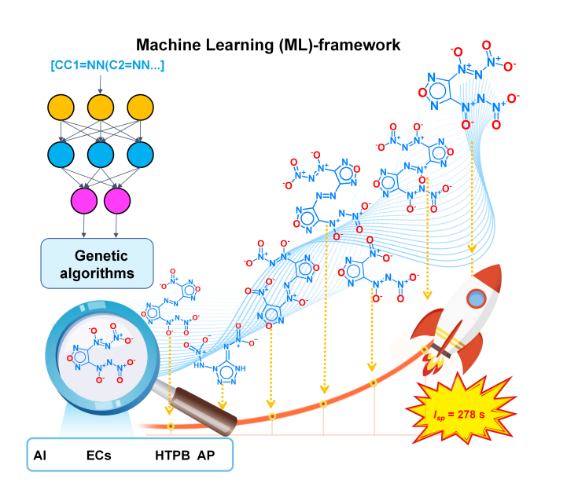
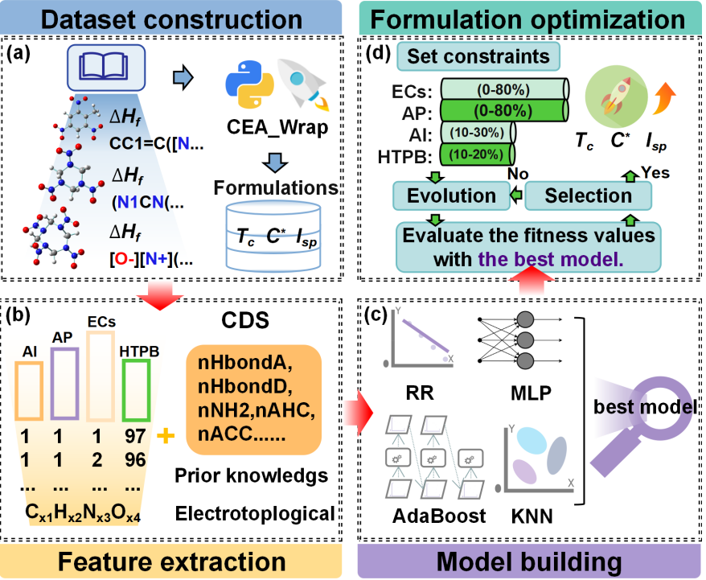
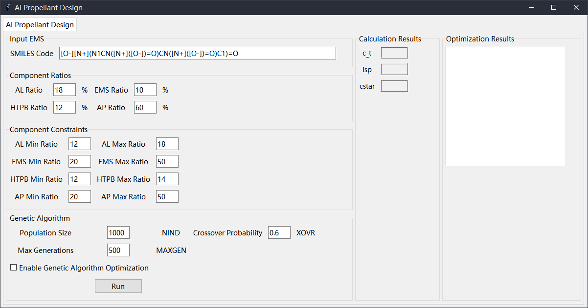

# Machine Learning-Driven Discovery of High Performance Solid Propellants

A novel artificial intelligence (AI) framework that integrates machine learning (ML) with Genetic Algorithms (GAs) is introduced to accelerate the design of solid propellants. This framework utilizes high-throughput screening to identify promising energetic compounds (ECs) and optimize their formulations, significantly enhancing propellant performance. Through this approach, seven promising ECs were identified from over 1,000 candidates, with the potential to increase the specific impulse (Isp) to 278 s and enhance the range by up to 45%.

## Training and Test Sets

The details of the training and test sets used in this study can be found in the article **Supplementary Data 1.csv**.

- Number of training sets: 398,129
- Number of test sets: 44,094

## Figures

### Figure 1
  
**Figure 1**: A novel machine learning (ML) framework integrating machine learning and Genetic Algorithms (GAs) to accelerate solid propellant design. Through high-throughput screening, seven promising ECs were identified from over 1,000 candidates. This approach has the potential to increase the specific impulse (Isp) to 278 s and improve the rocket range by up to 45%.

### Figure 2
  
**Figure 2**: The four main modules of the workflow:  
a) Construction of the dataset.  
b) Extraction of molecular features.  
c) Model building.  
d) Introduction of GAs to obtain the optimal contents of Al/ECs/HTPB/AP under certain constraints.

### Figure 3
  
**Figure 3**: The GUI interface developed to demonstrate the AI framework integrating machine learning and genetic algorithms. The framework can be launched by running `\GAS\geatpy_.py`.

## GUI Interface Launch

In this study, a GUI interface was developed to showcase the integrated machine learning and genetic algorithm framework. This interface can be launched by executing the script located at `\GAS\geatpy_.py`.

# AISFD
